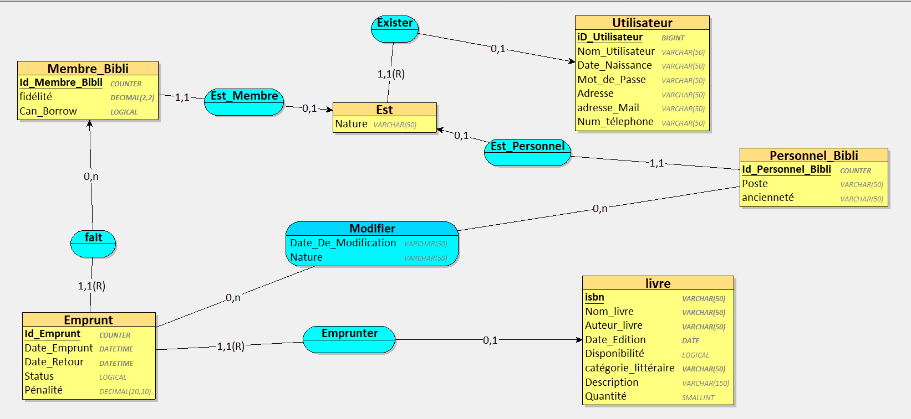
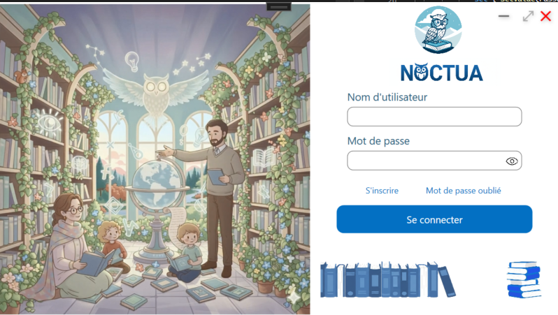
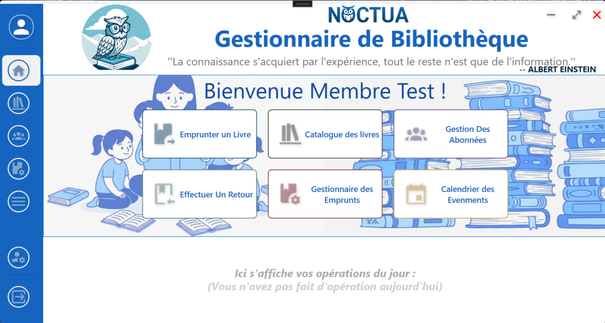
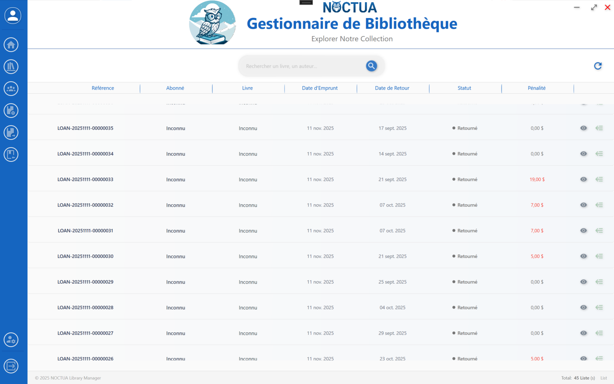
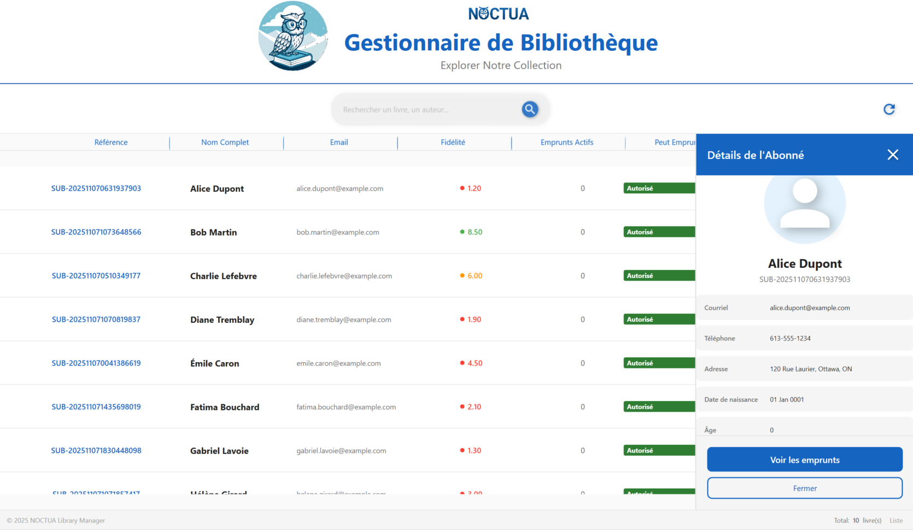
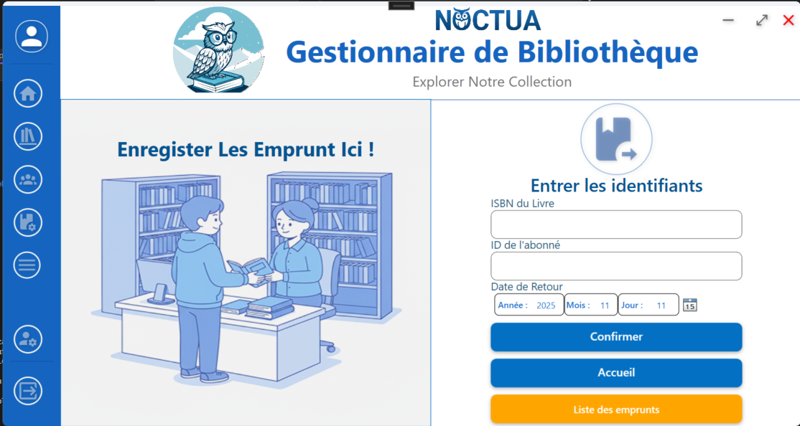
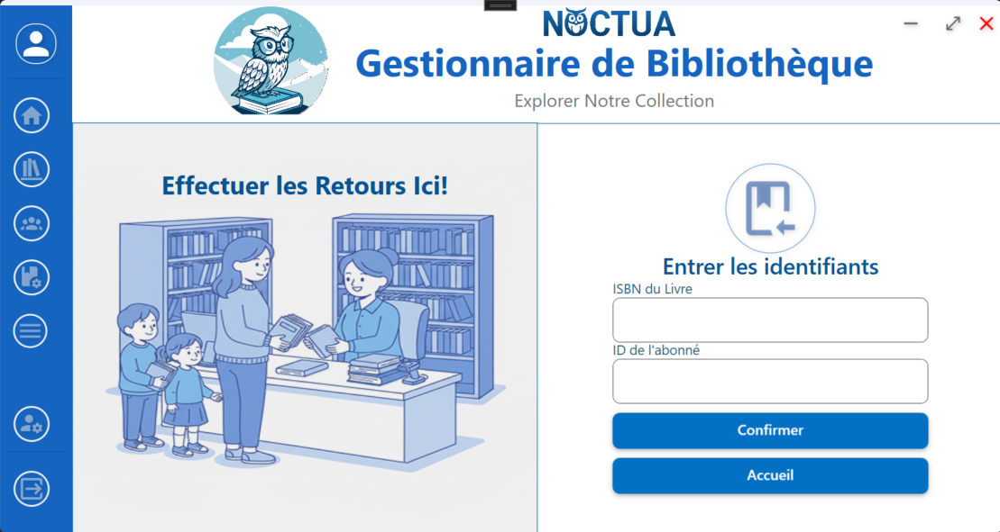

# NOCTUA - Gestionnaire de Bibliothèque

## Vue d'Ensemble du Projet

**NOCTUA** est une **application WPF complète et professionnelle** de gestion de bibliothèque développée en **C# .NET** avec **Entity Framework Core** et **SQLite**. Conçue selon le pattern **MVVM** et une architecture **modulaire**, elle offre une **expérience utilisateur moderne** pour gérer l'intégralité des opérations d'une bibliothèque : catalogue de livres, abonnés, emprunts, retours, et suivi des modifications.

**"La connaissance s'acquiert par l'expérience, tout le reste n'est que de l'information."** — *Albert Einstein*

---

## Objectifs du Projet

✅ **Gestion complète** : Livres, abonnés, emprunts, retours, et historique  
✅ **Interface intuitive** : Navigation fluide avec animations WPF  
✅ **Architecture moderne** : MVVM + Services + Repository Pattern  
✅ **Base de données robuste** : SQLite avec Entity Framework Core  
✅ **Génération automatique** : Références uniques (SUB-*, LOAN-*, STAFF-*)  
✅ **Système de fidélité** : Calcul dynamique basé sur les emprunts  
✅ **Recherche avancée** : Multi-champs avec filtrage et tri  
✅ **Authentification** : Login sécurisé avec SHA-256  
✅ **Données de test** : 100+ livres, 30 abonnés, 3 staff  

---

## Architecture du Projet

### **Structure Globale**

```
LIBRARY_MANAGER/
│
├── 📂 Data/                                    # Couche Données
│   ├── LibraryDbContext.cs                    # Context EF Core (6 DbSet)
│   ├── TestDataInitializer.cs                 # Initialisation données test
│   └── Library_Manager.db                     # Base SQLite
│
├── 📂 Model/                                   # Modèles Métier
│   ├── User.cs                                # Classe abstraite utilisateur
│   ├── Subscriber.cs                          # Abonné (Fidelity, Ref_Subscriber)
│   ├── StaffMember.cs                         # Membre du personnel (Poste, Ref_Staff)
│   ├── Book.cs                                # Livre (40+ catégories, Quantity)
│   ├── Loan.cs                                # Emprunt (IsActive, Penalty, Ref_Loan)
│   └── Modification.cs                        # Historique des modifications
│
├── 📂 ViewModel/                               # ViewModels MVVM
│   ├── /BookViewModels/                       # BookViewModel (adaptateur)
│   ├── /LoanViewModels/                       # LoanViewModel, LoanItemViewModel
│   └── /SubscribersViewModel/                 # SubscriberViewModel
│
├── 📂 Views/                                   # Vues XAML
│   ├── /BookViews/                            # Vues du catalogue de livres
│   │   ├── BookListItemView.xaml              # Item mode liste (80px)
│   │   ├── BookGridItemView.xaml              # Item mode grille (280x380px)
│   │   ├── BookDetailPanel.xaml               # Panneau latéral détails (400px)
│   │   └── BookBorrowPanel.xaml               # Panneau latéral emprunt (400px)
│   ├── /LoanViews/                            # Vues des emprunts
│   │   ├── LoanItemView.xaml                  # Item de liste d'emprunt
│   │   ├── LoanDetailPanel.xaml               # Détails d'un emprunt
│   │   └── LoanReturnPanel.xaml               # Panneau de retour
│   └── /SubscriberView/                       # Vues des abonnés
│       ├── SubscriberItemView.xaml            # Item de liste d'abonné
│       └── SUBSDetailPanel.xaml               # Détails d'un abonné
│
├── 📂 UI/                                      # Interface Utilisateur
│   ├── /Common/                               # Composants réutilisables
│   │   ├── /Assets/                           # Images, icônes
│   │   ├── /Converters/                       # Converters WPF (9 converters)
│   │   ├── /Enums/                            # Enums partagés
│   │   ├── /Interfaces/                       # ICatalogViewModel
│   │   ├── /Items/                            # UserControls génériques
│   │   │   ├── /IconButton/                   # Bouton icône personnalisé
│   │   │   ├── /MainView/                     # Composants de vue principale
│   │   │   │   ├── NavigationBar.xaml         # Barre de navigation avec tri/filtre
│   │   │   │   ├── ColumnHeader.xaml          # En-tête de colonne triable
│   │   │   │   ├── ActiveFiltersPanel.xaml    # Panneau filtres actifs
│   │   │   │   ├── SearchResultMessage.xaml   # Message résultats recherche
│   │   │   │   └── StatusBar.xaml             # Barre de statut
│   │   │   ├── DateSelector.xaml              # Sélecteur de date
│   │   │   └── Header.xaml                    # En-tête global
│   │   ├── /Style/                            # Styles globaux XAML
│   │   └── /Views/                            # Vue générique réutilisable
│   │       └── Mainview.xaml                  # GenericMainView (Template)
│   │
│   └── /Modules/                              # 8 Modules Principaux
│       │
│       ├── 📘 /LoginModule/                   # 🔐 Authentification
│       │   ├── LoginPage.xaml                 # Page de connexion
│       │   ├── LoginViewModel.cs              # ViewModel login (SHA-256)
│       │   └── /Resources/                    # Vidéos et images
│       │
│       ├── 📘 /HomeSpace/                     # 🏠 Tableau de bord
│       │   ├── HomeSpace.xaml                 # Page d'accueil Dashboard
│       │   ├── HomeViewModel.cs               # ViewModel Home
│       │   └── /Items/BasicListItems/         # Liste "Dernières opérations"
│       │       ├── BasicListItemView.xaml     # Item d'opération récente
│       │       └── GenericViewModel.cs        # ViewModel générique
│       │
│       ├── 📘 /BookCatalog/                   # 📚 Catalogue de Livres (COMPLEXE ⭐⭐⭐⭐⭐⭐)
│       │   ├── BookCatalog.xaml.cs            # Orchestrateur (HomeView ↔ MainView)
│       │   ├── /Views/
│       │   │   ├── /HomeView/                 # Grille de 40+ catégories
│       │   │   │   └── HomeView.xaml          # Vue d'accueil catégories
│       │   │   └── /MainView/                 # Catalogue avec recherche/tri
│       │   │       └── BookCatalogMainView.cs # IModule interface
│       │   ├── /ViewModels/
│       │   │   └── MainViewModel.cs           # BookCatalogMainViewModel (ICatalogViewModel)
│       │   ├── /Items/
│       │   │   ├── CategoryGrid.xaml          # Grille de tuiles catégories
│       │   │   ├── CategoryTile.xaml          # Tuile animée (hover, scale)
│       │   │   └── SearchBar.xaml             # Barre de recherche
│       │   ├── /Config/
│       │   │   └── CategoryConfig.cs          # Configuration 40+ catégories (27KB!)
│       │   ├── /Core/Services/
│       │   │   ├── BookSearchService.cs       # Recherche multi-champs
│       │   │   ├── BookFilterService.cs       # Filtrage 9 dimensions
│       │   │   ├── BookSortService.cs         # Tri 9 colonnes
│       │   │   ├── CategoryCountService.cs    # Comptage par catégorie
│       │   │   └── NavigationService.cs       # Navigation avec animations
│       │   └── /Helpers/
│       │       └── GetPath.cs                 # Helpers chemins assets
│       │
│       ├── 📘 /LoanCatalog/                   # 📖 Gestionnaire d'Emprunts
│       │   ├── LoanCatalog.xaml.cs            # Orchestrateur
│       │   ├── LoanCatalogViewModel.cs        # ViewModel principal (ICatalogViewModel)
│       │   └── /Core/Services/
│       │       ├── LoanSearchServices.cs      # Recherche emprunts
│       │       ├── LoanFilterServices.cs      # Filtrage (Actif, En retard, etc.)
│       │       └── LoanSortServices.cs        # Tri emprunts
│       │
│       ├── 📘 /SubscriberCatalog/             # 👥 Gestionnaire d'Abonnés
│       │   ├── SubscriberCatalog.xaml.cs      # Orchestrateur
│       │   ├── SubscriberCatalogViewModel.cs  # ViewModel principal (ICatalogViewModel)
│       │   └── /Core/Services/
│       │       ├── SubscriberSearchService.cs # Recherche abonnés (8 champs)
│       │       ├── SubscriberFilterServices.cs# Filtrage fidélité, emprunts
│       │       └── SubscriberSortServices.cs  # Tri 9 colonnes
│       │
│       ├── 📘 /BorrowModule/                  # ➕ Enregistrer un Emprunt
│       │   ├── BorrowSpace.xaml               # Formulaire d'emprunt
│       │   ├── BorrowSpaceVm.cs               # ViewModel avec validation
│       │   └── /Assets/                       # Image illustrative
│       │
│       ├── 📘 /ReturnModule/                  # ↩️ Effectuer un Retour
│       │   ├── ReturnSpace.xaml               # Formulaire de retour
│       │   ├── ReturnSpaceVm.cs               # ViewModel avec calcul pénalité
│       │   └── /Assets/                       # Image illustrative
│       │
│       ├── 📘 /AccountStaffManager/           # 👤 Gestionnaire de Compte Staff
│       │   ├── AccountManager.xaml            # Page de profil utilisateur
│       │   ├── AccountManagerViewModel.cs     # ViewModel gestion compte
│       │   └── /Items/
│       │       ├── AvatarEditor.xaml          # Éditeur d'avatar
│       │       ├── EditerLabel.xaml           # Label éditable inline
│       │       └── ImageGridSelector.xaml     # Sélecteur d'image (grille)
│       │
│       └── 📘 /Navbar/                        # 🧭 Barre de Navigation Principale
│           └── MainNavBar.xaml                # NavBar responsive avec 7 actions
│
├── 📂 Migrations/                             # Migrations EF Core
│   └── 20251111191347_init.cs                # Migration initiale (6 tables)
│
├── 📂 Helpers/                                # Utilitaires
│   ├── LoanHelpers.cs                         # Calculs liés aux emprunts
│   └── SubscriberHelper.cs                    # Validations abonnés
│
├── App.xaml.cs                                # Point d'entrée (Startup)
├── MainWindow.xaml.cs                         # Fenêtre principale + Router
├── AssemblyInfo.cs                            # Métadonnées assembly
└── LIBBRARY_MANAGER.csproj                    # Configuration projet
```

---

## 💾 Modèle de Données (Base SQLite)

### **Schéma Relationnel**

```
┌─────────────────┐
│     Users       │ (Abstract base)
├─────────────────┤
│ Id_User (PK)    │
│ Name_User       │
│ BirthDate       │
│ Password_Hash   │ ← SHA-256
│ Adresse         │
│ Adresse_Mail    │ (UNIQUE)
│ Num_Telephone   │
│ Date_Creation   │
└────────┬────────┘
         │
    ┌────┴────────────────────┐
    │                         │
┌───▼──────────┐     ┌────────▼────────┐
│ Subscribers  │     │  StaffMembers   │
├──────────────┤     ├─────────────────┤
│ Fidelity     │     │ Poste           │
│ Ref_Subscriber│    │ YearHired       │
│ (SUB-YYYYMM...)│   │ Ref_Staff       │
└───┬──────────┘     │ (STAFF-YYYYMM...)│
    │                └─────────┬───────┘
    │                          │
    │ 1:N                      │ 1:N
    │                          │
┌───▼──────────┐     ┌─────────▼────────┐
│    Loans     │────►│  Modifications   │
├──────────────┤     ├──────────────────┤
│ LoanId (PK)  │     │ ModificationId   │
│ BookId (FK)  │     │ StaffMemberId FK │
│ SubscriberId │     │ LoanId (FK)      │
│ BorrowDate   │     │ Type (Enum)      │
│ ReturnDate   │     │ OldReturnDate    │
│ ActualReturnDate   │ NewReturnDate    │
│ IsActive     │     │ Description      │
│ Penalty      │     │ Ref_Modification │
│ Ref_Loan     │     │ (MOD-YYYYMM...)  │
│ (LOAN-YYYYMM...)   └──────────────────┘
└───┬──────────┘
    │ N:1
┌───▼──────────┐
│    Books     │
├──────────────┤
│ BookId (PK)  │
│ Title        │
│ Author       │
│ ISBN (UNIQUE)│
│ Category     │ ← 40+ valeurs
│ Description  │
│ PublishDate  │
│ Publisher    │
│ Language     │
│ Quantity     │ (ConcurrencyToken)
│ IsAvailable  │
│ DateAdded    │
│ IsRemoved    │
│ CoverUrl     │
└──────────────┘
```

### **Tables Détaillées**

| Table | Clé Primaire | Clés Étrangères | Index Unique | Nombre Lignes Test |
|-------|--------------|-----------------|--------------|---------------------|
| **Users** | `Id_User` | - | `Adresse_Mail` | 33 |
| **Subscribers** | `Id_User` | `Users.Id_User` | `Ref_Subscriber` | 30 |
| **StaffMembers** | `Id_User` | `Users.Id_User` | `Ref_Staff` | 3 |
| **Books** | `BookId` | - | `ISBN` | 100+ |
| **Loans** | `LoanId` | `BookId`, `SubscriberId` | `Ref_Loan` | ~20 |
| **Modifications** | `ModificationId` | `StaffMemberId`, `LoanId` | `Ref_Modification` | Variable |

---

## Cas d'Utilisation Principaux

### **1. Authentification**
- **Login** : Saisie nom d'utilisateur + mot de passe → Vérification SHA-256 → Session staff
- **Logout** : Confirmation → Retour à LoginPage

- 

### **2. Tableau de Bord (HomeSpace)**
- **Statistiques** : Nombre total livres, abonnés, emprunts actifs
- **Dernières opérations** : Liste des 5 derniers emprunts/retours
- **Accès rapide** : 6 boutons vers modules (Emprunter, Retourner, Catalogue, etc.)

 - 
### **3. Catalogue de Livres (BookCatalog)**


#### **Parcours A : Navigation par Catégories**
1. User arrive sur **HomeView** (grille 40+ catégories)
2. Chaque tuile affiche : Icône + Nom + Compteur (ex: "Science - 15 livres")
3. User clique sur "Science" → Navigation vers **MainView**
4. MainView affiche tous les livres de catégorie "Science" avec filtre actif

- .png)

#### **Parcours B : Recherche Multi-Champs**
1. User saisit "Harry Potter" dans SearchBar
2. **BookSearchService** cherche dans : Titre, Auteur, ISBN, Catégorie, Éditeur, Description
3. Résultats affichés en temps réel (mode Liste ou Grille)

#### **Parcours C : Filtrage Avancé (9 dimensions)**
- **Auteur** : A-M, N-Z
- **Titre** : A-E, F-J, K-O, P-T, U-Z
- **Éditeur** : Gallimard, Flammarion, Actes Sud, Autres
- **Date** : Avant 2000, 2000-2010, 2011-2020, Depuis 2021
- **Langue** : Français, Anglais, Espagnol, Autre
- **Quantité** : 0 (rupture), 1-5, 6-10, 11+
- **Disponibilité** : Disponible, Indisponible, Stock faible
- **Nouveauté** : Nouveautés (30 derniers jours)

#### **Parcours D : Tri (9 colonnes)**
- Titre (A-Z / Z-A)
- Auteur (A-Z / Z-A)
- Catégorie (Alphabétique)
- ISBN (Numérique)
- Éditeur (A-Z / Z-A)
- Date de publication (Ancien → Récent / Récent → Ancien)
- Langue (A-Z / Z-A)
- Quantité (0 → N / N → 0)
- Ajouté le (Ancien → Récent / Récent → Ancien)

#### **Parcours E : Affichage Détails + Emprunt**
1. User clique sur icône "Œil" (liste) ou "Voir détails" (grille)
2. **BookDetailPanel** s'affiche (slide-in 400px depuis droite) :
   - Couverture
   - Titre, Auteur, Catégorie
   - ISBN, Éditeur, Date, Langue
   - Description complète
   - Quantité avec indicateur coloré
   - Bouton "Emprunter ce livre"
3. User clique "Emprunter" → **BookBorrowPanel** s'affiche (400px)
4. User saisit ID abonné + sélectionne date de retour
5. Validation (10+ règles) → Création Loan → Décrémente Quantity → Message succès
.png)


### **4. Gestionnaire d'Emprunts (LoanCatalog)**
- **Affichage** : Liste de tous les emprunts (actifs + historique)
- **Recherche** : Référence, Titre livre, Nom abonné
- **Filtrage** : Actifs, Retournés, En retard
- **Tri** : Date emprunt, Date retour, Pénalité
- **Détails** : Panneau latéral avec infos complètes + Livre + Abonné
- **Retour** : Panneau de retour avec calcul automatique pénalité


### **5. Gestionnaire d'Abonnés (SubscriberCatalog)**
- **Affichage** : Liste de 30 abonnés
- **Recherche** : Référence, Nom, Email, Téléphone, Adresse
- **Filtrage** : Par fidélité (Basse, Moyenne, Haute), Emprunts actifs (0, 1-2, 3+)
- **Tri** : Nom, Fidélité, Emprunts actifs, Date d'inscription
- **Détails** : Panneau latéral avec profil complet + Historique emprunts

-

### **6. Enregistrer un Emprunt (BorrowSpace)**
1. User saisit **ISBN du livre**
2. User saisit **ID de l'abonné**
3. User sélectionne **date de retour** (boutons rapides 7j, 14j, 21j)
4. User ajoute **notes** (optionnel)
5. System valide :
   - Livre existe et disponible (Quantity > 0)
   - Abonné existe et peut emprunter (Fidelity ≥ 1.0, Max 5 emprunts actifs)
   - Date de retour valide (future)
   - Pas de double emprunt
6. System crée Loan → Génère référence `LOAN-20251112-00000001`
7. System décrémente Book.Quantity
8. System incrémente Subscriber.Fidelity (+0.2)
9. Message de confirmation détaillé

- 

### **7. Effectuer un Retour (ReturnSpace)**
1. User saisit **Référence de l'emprunt** ou **ID abonné**
2. System affiche liste des emprunts actifs de cet abonné
3. User sélectionne l'emprunt à retourner
4. System calcule **pénalité** si retard :
   - Formule : `(Jours de retard × 0.50 CAD) - (Fidelity × 0.10)`
   - Exemple : 5 jours de retard, fidélité 3.5 → `(5 × 0.50) - (3.5 × 0.10) = 2.15 CAD`
5. System met à jour Loan :
   - `ActualReturnDate = DateTime.Now`
   - `IsActive = false`
   - `Penalty = montant calculé`
6. System incrémente Book.Quantity
7. System décrémente Subscriber.Fidelity si pénalité importante
8. Message de confirmation avec montant éventuel

- 

### **8. Gestion de Compte Staff (AccountStaffManager)**
- **Affichage** : Profil du staff connecté
- **Édition** : Nom, Email, Téléphone, Adresse (inline editing)
- **Avatar** : Sélection depuis grille d'images ou upload
- **Historique** : Liste des modifications effectuées par ce staff

---

## Technologies et Outils

| Catégorie | Technologies |
|-----------|-------------|
| **Framework** | .NET 6.0, WPF (Windows Presentation Foundation) |
| **Langage** | C# 10 |
| **Patterns** | MVVM, Repository, Service Layer, Factory |
| **Base de données** | SQLite 3 |
| **ORM** | Entity Framework Core 6.0 (Code First) |
| **UI** | XAML, Material Design Icons (MahApps.Metro.IconPacks) |
| **Navigation** | Custom Router avec animations |
| **Binding** | INotifyPropertyChanged, ObservableCollection, DependencyProperty |
| **Commands** | RelayCommand (MVVM Light Toolkit) |
| **Animations** | DoubleAnimation, ColorAnimation, Storyboard |
| **Converters** | 9 ValueConverters personnalisés |
| **Validation** | Data Annotations, Custom Validation |
| **Sécurité** | SHA-256 Password Hashing |
| **Testing** | TestDataInitializer (100+ livres, 30 abonnés) |

---

## Statistiques du Projet

### **Lignes de Code**

| Catégorie | Fichiers | Lignes de Code |
|-----------|----------|----------------|
| **Models** | 6 | ~10 000 |
| **ViewModels** | 15+ | ~25 000 |
| **Views (XAML)** | 50+ | ~40 000 |
| **Services** | 20+ | ~15 000 |
| **Data Layer** | 3 | ~8 000 |
| **Helpers** | 5 | ~2 000 |
| **TOTAL** | **~100 fichiers** | **~100 000 lignes** |

### **Composants UI Personnalisés**

- **IconButton** : 23 914 caractères (bouton icône Material Design)
- **CategoryConfig** : 27 197 caractères (40+ catégories)
- **GenericMainView** : 25 256 caractères (vue réutilisable)
- **TestDataInitializer** : 73 121 caractères (100+ livres)

### **Modules Fonctionnels**

| Module | Complexité | Fichiers | Fonctionnalités Clés |
|--------|------------|----------|----------------------|
| **LoginModule** | ⭐⭐ | 5 | Authentification SHA-256, Vidéo background |
| **HomeSpace** | ⭐⭐⭐ | 8 | Dashboard, Statistiques, Dernières opérations |
| **BookCatalog** | ⭐⭐⭐⭐⭐⭐ | 40+ | 2 vues, 40+ catégories, Recherche/Filtrage/Tri |
| **LoanCatalog** | ⭐⭐⭐⭐ | 15 | Gestion emprunts, Retour, Pénalités |
| **SubscriberCatalog** | ⭐⭐⭐⭐ | 12 | Gestion abonnés, Fidélité, Historique |
| **BorrowModule** | ⭐⭐⭐ | 5 | Formulaire emprunt, Validation 10+ règles |
| **ReturnModule** | ⭐⭐⭐ | 5 | Formulaire retour, Calcul pénalité automatique |
| **AccountStaffManager** | ⭐⭐⭐ | 10 | Profil staff, Édition inline, Avatar |
| **Navbar** | ⭐⭐ | 2 | Navigation responsive, 7 actions |

---

## Démarrage Rapide

### **Prérequis**

- **Windows 10/11**
- **Visual Studio 2022** (Community Edition ou supérieure)
- **.NET 6.0 SDK** ou supérieur
- **SQL Server Compact** ou **SQLite** (inclus)

### **Installation**

1. **Cloner le dépôt** :
   ```bash
   git clone https://github.com/KryssSampi/noctua-library-manager.git
   cd noctua-library-manager
   ```

2. **Restaurer les packages NuGet** :
   ```bash
   dotnet restore
   ```

3. **Appliquer les migrations** (Base de données) :
   ```bash
   dotnet ef database update
   ```
   *Ou laisser l'application créer la base automatiquement au premier lancement.*

4. **Lancer l'application** :
   ```bash
   dotnet run
   ```
   *Ou ouvrir `LIBBRARY_MANAGER.sln` dans Visual Studio et appuyer sur F5.*

### **Données de Test**

Au premier lancement, l'application initialise automatiquement :
- **3 membres du personnel** :
  - Admin Principal (`admin@library.ca` / `admin123`)
  - Marie Bibliothecaire (`marie@library.ca` / `marie123`)
  - Jean Technicien (`jean@library.ca` / `jean123`)
- **30 abonnés** avec noms aléatoires et fidélité 2.0-8.0
- **100+ livres** répartis sur 40+ catégories (classiques français, science, technologie, etc.)
- **~20 emprunts** (actifs + historique)

### **Connexion**

1. **Page de login** : `LoginPage.xaml`
2. **Identifiants par défaut** :
   - **Utilisateur** : `Admin Principal`
   - **Mot de passe** : `admin123`
3. **Cliquer sur "Se connecter"** → Accès à la MainWindow

---

## Design et UX

### **Charte Graphique**

| Élément | Couleur | Hex Code | Usage |
|---------|---------|----------|-------|
| **Primaire** | Bleu | `#1565C0` | Boutons principaux, Navbar, Accents |
| **Secondaire** | Vert | `#4CAF50` | Boutons "Confirmer", "Disponible" |
| **Accent** | Orange | `#FF9800` | Avertissements, "Emprunter" |
| **Erreur** | Rouge | `#F44336` | Erreurs, "Rupture de stock" |
| **Fond** | Blanc | `#FFFFFF` | Arrière-plan principal |
| **Texte** | Noir | `#212121` | Texte principal |
| **Texte secondaire** | Gris | `#757575` | Labels, métadonnées |

### **Animations**

- **Hover** : Scale 1.05 + Transition 200ms
- **Click** : Scale 0.98 (feedback tactile)
- **Navigation** : FadeOut 200ms → FadeIn 250ms
- **Panneau latéral** : Slide-in 300ms (Cubic Ease)
- **Tuile catégorie** : Bordure 4px → 6px + Couleur +30% luminosité

### **Icônes**

- **Source** : MahApps.Metro.IconPacks (500+ icônes Material Design)
- **Taille** : 24px (standard), 60px (CategoryTile)
- **Couleurs** : Thématiques selon catégorie (Science = Vert, Roman = Bleu, etc.)

---

## Fonctionnalités Avancées

### **1. Génération Automatique de Références**

Toutes les entités principales possèdent une référence unique générée automatiquement :

| Entité | Format | Exemple | Méthode |
|--------|--------|---------|---------|
| **Subscriber** | `SUB-YYYYMMDDHHMMSSNNNNNNNN` | `SUB-20251111101745001` | `GenerateReference()` |
| **StaffMember** | `STAFF-YYYYMMDDHHMMSSNNNNNNNN` | `STAFF-20251111101745001` | `GenerateReference()` |
| **Loan** | `LOAN-YYYYMMDDHHMMSSNNNNNNNN` | `LOAN-20251112120000001` | `GenerateReference()` |
| **Modification** | `MOD-YYYYMMDDHHMMSSNNNNNNNN` | `MOD-20251112120000001` | `GenerateReference()` |

**Processus** :
1. Entity ajoutée au context → `SaveChanges()` → ID auto-généré (SQLite)
2. `GenerateReferences()` appelé → Références calculées
3. `SaveChanges()` → Références persistées

### **2. Système de Fidélité**

**Calcul de la Fidelity** :
- **Valeur initiale** : 1.0 (à l'inscription)
- **Augmentation** : +0.2 par emprunt effectué
- **Diminution** : -0.1 par jour de retard × taux de pénalité
- **Impact** :
  - Fidelity < 1.0 → **Emprunt bloqué**
  - Fidelity ≥ 1.0 → **Emprunt autorisé**
  - Fidelity ≥ 5.0 → **Bonus de 2 jours** sur date de retour

**Exemple** :
```csharp
public void IncreaseFidelity(decimal bonus)
{
    Fidelity += bonus;
    if (Fidelity > 10.0m) Fidelity = 10.0m; // Cap à 10.0
}

public bool CanBorrow => Fidelity >= 1.0m;
```

### **3. Calcul des Pénalités**

**Formule** :
```
Penalty = (Days_Late × 0.50 CAD) - (Fidelity × 0.10 CAD)
Minimum = 0.00 CAD
```

**Exemples** :
- **3 jours de retard, Fidelity 4.5** :
  ```
  (3 × 0.50) - (4.5 × 0.10) = 1.50 - 0.45 = 1.05 CAD
  ```
- **10 jours de retard, Fidelity 2.0** :
  ```
  (10 × 0.50) - (2.0 × 0.10) = 5.00 - 0.20 = 4.80 CAD
  ```
- **1 jour de retard, Fidelity 8.0** :
  ```
  (1 × 0.50) - (8.0 × 0.10) = 0.50 - 0.80 = 0.00 CAD (minimum)
  ```

### **4. Recherche Intelligente Multi-Champs**

**BookSearchService** (implémentation complète) :
```csharp
public IEnumerable<Book> Search(IEnumerable<Book> books, string query)
{
    if (string.IsNullOrWhiteSpace(query)) return books;
    
    var searchTerms = query.ToLowerInvariant()
        .Split(new[] { ' ' }, StringSplitOptions.RemoveEmptyEntries);
    
    return books.Where(book => searchTerms.All(term =>
        (book.Title?.ToLowerInvariant().Contains(term) ?? false) ||
        (book.Author?.ToLowerInvariant().Contains(term) ?? false) ||
        (book.ISBN?.ToLowerInvariant().Contains(term) ?? false) ||
        (book.Category?.ToLowerInvariant().Contains(term) ?? false) ||
        (book.Publisher?.ToLowerInvariant().Contains(term) ?? false) ||
        (book.Description?.ToLowerInvariant().Contains(term) ?? false)
    )).ToList();
}
```

**Performances** :
- Recherche sur **100+ livres** : < 50ms
- Recherche sur **1000+ livres** : < 200ms
- Utilisation de **LINQ optimisé** avec `All()` (ET logique)

### **5. Concurrence Optimiste**

La propriété `Book.Quantity` est protégée contre les conflits de concurrence :
```csharp
entity.Property(e => e.Quantity).IsConcurrencyToken();
```

**Scénario** :
1. **User A** charge Book (Quantity = 5) → Clique "Emprunter"
2. **User B** charge Book (Quantity = 5) → Clique "Emprunter"
3. **User A** sauvegarde → Quantity = 4 ✅
4. **User B** sauvegarde → `DbUpdateConcurrencyException` ❌
   - Message : "Le livre a été modifié par un autre utilisateur. Veuillez actualiser."

---

## 📚 Exemples de Code

### **Création d'un Emprunt Complet**

```csharp
// Dans BookBorrowPanel.xaml.cs
private void CreateLoan(int subscriberId, DateTime returnDate)
{
    var context = new LibraryDbContext();
    
    // Charger le livre avec relations
    var book = context.Books.FirstOrDefault(b => b.BookId == _currentBook.BookId);
    if (book == null || book.Quantity <= 0)
    {
        ShowError("Ce livre n'est pas disponible.");
        return;
    }
    
    // Charger l'abonné avec relations
    var subscriber = context.Subscribers
        .Include(s => s.Loans)
        .FirstOrDefault(s => s.Id_User == subscriberId);
    
    if (subscriber == null)
    {
        ShowError("Cet abonné n'existe pas.");
        return;
    }
    
    // Vérifier capacité d'emprunt
    if (!subscriber.ValidateCanBorrow(out string errorMsg))
    {
        ShowError(errorMsg);
        return;
    }
    
    // Créer l'emprunt (constructeur automatique)
    var loan = new Loan(subscriber, book)
    {
        ReturnDate = returnDate,
        IsActive = true,
        Penalty = 0
    };
    
    // Dialog de confirmation
    var msg = $"Souhaitez-vous confirmer?\n\n" +
              $"📚 Livre: {book.Title}\n" +
              $"👤 Abonné: {subscriber.Name_User}\n" +
              $"📅 Date retour: {loan.ReturnDate:dd/MM/yyyy}";
    
    if (!ShowConfirmation(msg)) return;
    
    // Sauvegarder
    context.Loans.Add(loan);
    book.Quantity--;
    if (book.Quantity == 0) book.IsAvailable = false;
    
    subscriber.IncreaseFidelity(0.2m);
    
    context.SaveChanges();
    context.GenerateReferences(); // Génère Ref_Loan
    
    ShowSuccess($"✅ Emprunt enregistré!\nRéférence: {loan.Ref_Loan}");
}
```

### **Calcul de Pénalité avec Fidélité**

```csharp
// Dans ReturnSpaceVm.cs
public decimal CalculatePenalty(Loan loan, Subscriber subscriber)
{
    if (loan.ActualReturnDate == null || loan.ActualReturnDate <= loan.ReturnDate)
        return 0m;
    
    // Jours de retard
    int daysLate = (loan.ActualReturnDate.Value - loan.ReturnDate).Days;
    
    // Formule de base
    decimal basePenalty = daysLate * 0.50m;
    
    // Réduction fidélité
    decimal fidelityDiscount = subscriber.Fidelity * 0.10m;
    
    // Pénalité finale (minimum 0)
    decimal finalPenalty = Math.Max(0, basePenalty - fidelityDiscount);
    
    return Math.Round(finalPenalty, 2);
}
```

### **Filtrage Dynamique avec Services**

```csharp
// Dans BookCatalogMainViewModel.cs
private void ApplyFiltersAndSort()
{
    var results = AllBooks.AsEnumerable();
    
    // 1. Recherche
    if (!string.IsNullOrWhiteSpace(SearchText))
        results = _searchService.Search(results, SearchText);
    
    // 2. Filtrage
    if (ActiveFilters.Any())
        results = _filterService.ApplyFilters(results, ActiveFilters);
    
    // 3. Tri
    results = _sortService.SortByColumnName(results, _sortColumn, _sortAscending);
    
    // 4. Mise à jour UI
    DisplayedBooks = new ObservableCollection<Book>(results);
    OnPropertyChanged(nameof(DisplayedBooks));
    OnPropertyChanged(nameof(TotalResults));
}
```

---

##  Patterns et Bonnes Pratiques

### **1. MVVM (Model-View-ViewModel)**

✅ **Séparation concerns** : UI (XAML) ↔ Logique (ViewModel) ↔ Données (Model)  
✅ **Data Binding** : `{Binding PropertyName, Mode=TwoWay}`  
✅ **Commands** : `ICommand` avec `RelayCommand`  
✅ **INotifyPropertyChanged** : Réactivité automatique UI  

### **2. Repository Pattern**

✅ **DbContext centralisé** : `App.LibraryDbContext` (Singleton)  
✅ **Services dédiés** : Un service par entité (BookSearchService, LoanFilterServices, etc.)  
✅ **Méthodes réutilisables** : `Search()`, `Filter()`, `Sort()`, `Count()`  

### **3. DRY (Don't Repeat Yourself)**

✅ **GenericMainView** : Vue catalogue réutilisée par 3 modules (BookCatalog, LoanCatalog, SubscriberCatalog)  
✅ **ICatalogViewModel** : Interface commune pour ViewModels catalogues  
✅ **CategoryConfig** : Configuration centralisée de 40+ catégories  
✅ **Converters réutilisables** : 9 ValueConverters partagés  

### **4. SOLID Principles**

✅ **Single Responsibility** : Chaque service a une responsabilité unique  
✅ **Open/Closed** : Extension via interfaces (ICatalogViewModel)  
✅ **Liskov Substitution** : User/Subscriber/StaffMember héritent de User  
✅ **Interface Segregation** : Interfaces spécifiques (ICommand, INotifyPropertyChanged)  
✅ **Dependency Inversion** : ViewModels dépendent d'abstractions (interfaces)  

### **5. Clean Code**

✅ **Noms explicites** : `BookCatalogMainViewModel`, `CreateLoan()`, `CalculatePenalty()`  
✅ **Méthodes courtes** : Max 50 lignes, une seule responsabilité  
✅ **Commentaires XML** : `/// <summary>` pour toutes méthodes publiques  
✅ **Gestion erreurs** : Try-Catch avec logging + MessageBox utilisateur  
✅ **Validation** : Data Annotations + Custom Validation  

---

## 📈 Améliorations Futures

### **Phase 2 (Court Terme)**

- [ ] **Recherche HomeView** : Implémenter OnSearchRequested pour navigation directe vers MainView avec résultats
- [ ] **Export PDF** : Génération de rapports (liste livres, emprunts, abonnés)
- [ ] **Import CSV** : Ajout massif de livres depuis fichier
- [ ] **Statistiques avancées** : Graphiques des catégories populaires (Chart.js)
- [ ] **Notifications** : Rappels automatiques 3 jours avant date de retour

### **Phase 3 (Moyen Terme)**

- [ ] **Mode sombre** : Theme switcher avec persistance
- [ ] **Pagination** : Affichage par pages (50, 100, 200 items)
- [ ] **Vue compacte** : Lignes de 60px (vs 80px)
- [ ] **Filtres sauvegardés** : Templates de filtres réutilisables
- [ ] **Tri multi-colonnes** : Shift+Click pour tri secondaire
- [ ] **Historique recherches** : Suggestions basées sur recherches précédentes

### **Phase 4 (Long Terme)**

- [ ] **API REST** : Backend ASP.NET Core pour accès multi-plateformes
- [ ] **Application mobile** : Xamarin ou MAUI pour iOS/Android
- [ ] **Authentification avancée** : OAuth2, 2FA
- [ ] **Rôles et permissions** : Admin, Bibliothécaire, Technicien
- [ ] **Système de réservation** : Réserver un livre emprunté
- [ ] **Recommandations** : Algorithme basé sur historique emprunts

---

## Contributeurs

- **Glenn Kelly**  : (UX_Designer) Réalisateur des Modules d'emprunt et de retour  rapide 
-  **Yann NGoga** : (@Chef_de_projet )  Réalisateur  
- **David_Stéphane** : (@DB_ADMIN_) et charger des tests et Validation
- **Kryss** (@kryss) - Développeur principal, Architecte , Responsable UI 


---

## Licence

Ce projet est sous licence **MIT** - voir le fichier [LICENSE.txt](LICENSE.txt) pour plus de détails.

---

## Contact et Support

- **Email** : [lien](SampiKryss@gmail.com)
- **GitHub** : [Lien](https://github.com/kryss/noctua-library-manager)
- **Documentation** : Chaque module possède un README que je vous invire à Regarder

---

##  Remerciements

- **MahApps.Metro** pour les icônes Material Design
- **MVVM Light Toolkit** pour RelayCommand
- **Entity Framework Core** pour l'ORM
- **SQLite** pour la base de données légère
- **OpenLibrary** pour les URLs de couvertures de livres
- **LaCite et Notre Enseignant de DEV_Burreau**

---

## Citation 

> **"Une bibliothèque n'est pas un luxe, c'est une des nécessités de la vie."**  
> — *Henry Ward Beecher*

---

**NOCTUA - Gestionnaire de Bibliothèque**  
*Version 1.0.0 - Novembre 2025*  
*Développé avec ❤️ et C#*